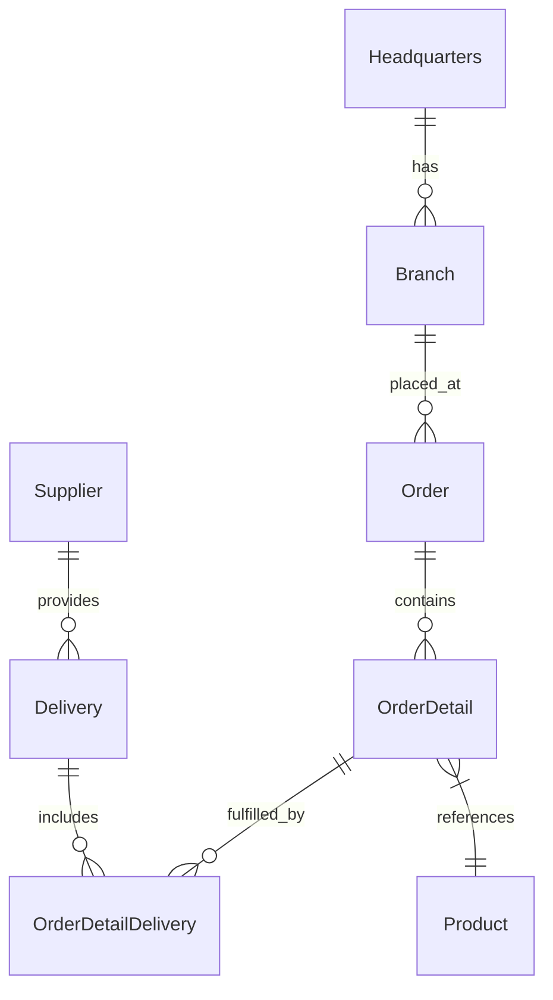

# 🚀 OctoCAT Supply Chain Management System


Welcome to the OctoCAT Supply Chain Management System - showcasing the incredible capabilities of GitHub Copilot, and the power of AI-assisted development!

## ✨ Exercise Overview
This project is designed to demonstrate the potential of GitHub Copilot in a real-world application. 

The OctoCAT Supply Chain Management System is a fully functional web application that allows users to manage orders, deliveries, and suppliers.
It includes a frontend built with React and a backend API built with Express.js. The application is designed to be easy to use and understand, making it perfect for demonstrating the capabilities of GitHub Copilot.

- 🤖 **Copilot Agent Mode & Vision** - Watch Copilot understand UI designs and implement complex features across multiple files
- 🧪 **Test Generation** - Exhibit Copilot's ability to analyze coverage and generate meaningful tests
  
## 🏗️ Architecture

The application is built using modern TypeScript with a clean separation of concerns:



### Tech Stack
- **Frontend**: React 18+, TypeScript, Tailwind CSS, Vite
- **Backend**: Express.js, TypeScript, OpenAPI/Swagger


## 🎯 Key Scenarios

1. **Vibe Coding**
   - Implement a shopping cart from a design mockup
   - Watch Copilot analyze, plan, and implement across multiple files
   - Show real-time UI updates and state management

2. **Automated Testing**
  
   - Create and execute unit tests with intelligent test generation

## 🚀 Getting Started

1. Fork [this](https://github.com/pm-self-learning/octocat-supply-copilot-exercise) repository into your own GitHub account and clone it to your local machine.
   
2. Build the projects:
   ```bash
   # Build API and Frontend
   npm install && npm run build
   ```
3. Start the application:
   ```bash
   npm run dev
   ```

Or use the VS Code tasks:
- `Cmd/Ctrl + Shift + P` -> `Run Task` -> `Build All`
- Use the Debug panel to run `Start API & Frontend`

## Next Steps

- Complete the [exercise guide](./docs/exercise.md) for detailed instructions on how to use Copilot features

## 🌐 GitHub Pages Deployment

This project is configured for automatic deployment to GitHub Pages. When you push to the `main` branch, the frontend will be automatically built and deployed.

### Setup GitHub Pages
1. Go to your repository settings
2. Navigate to "Pages" in the sidebar
3. Set the source to "GitHub Actions"
4. The deployment will happen automatically on the next push to `main`

The deployed application will be available at: `https://[your-username].github.io/octocat-supply-copilot-exercise/`

**Note**: The backend API is not deployed with GitHub Pages (static hosting only). The frontend will show a warning message when running in production mode without an API backend.

## 📚 Documentation

- [Detailed Architecture](./docs/architecture.md)


